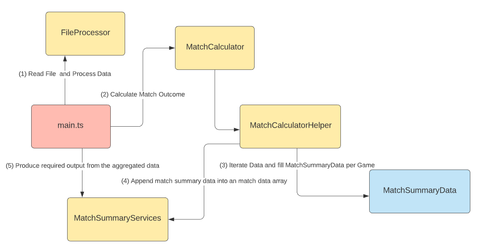

# Tennis Calculator Code Challenge

This is the output for tennis calculator code challenge. The details of code challenge is [here](reference/README.md).

# Get Started

Use Node.js version 14 and latest yarn installed.

```bash
# install dependencies
yarn i

# Run application with default data file
yarn start

# Run application with new data file (make sure to add the file to the data folder) 
yarn start -- <new file name> # e.g. yarn start -- full_tournament_2.txt

# Run test (using Mocha)
yarn run test

# Run Integration test
yarn run test:int

# watch test
yarn run test:watch

# watch Integration test
yarn run test:int:watch
```

# Solution Summary

Used TypeScript with the OOP style. First, FileProcessor read file and create an array of data. MatchCalculator iterates the array. Then, MatchCalculaterHelper populate the MatchSummaryData model with match results per match. Each MatchSummaryData is pushed to an array as the property of MatchSummaryServices. Then, MatchSummaryServices uses the array of match data to produce required output.



# Folder structure

```bash
- data # where match data files are
- integration # For integration tests
- reference # instruction & img for documentation
- src # source folder
  - constants # constant values
  - models # for data models
  - services # service logics
  - main.ts # Entry file
```
